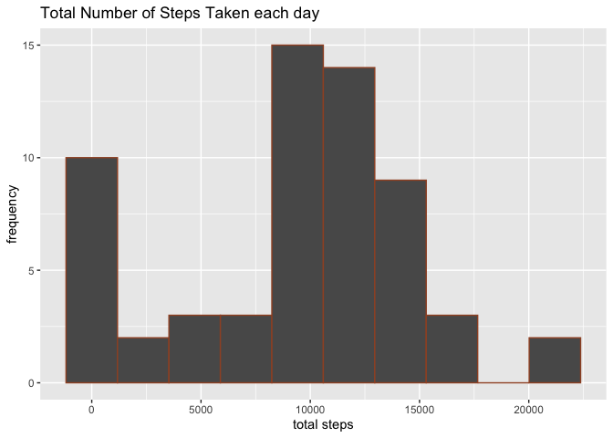
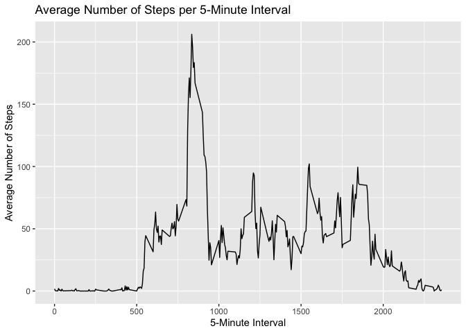
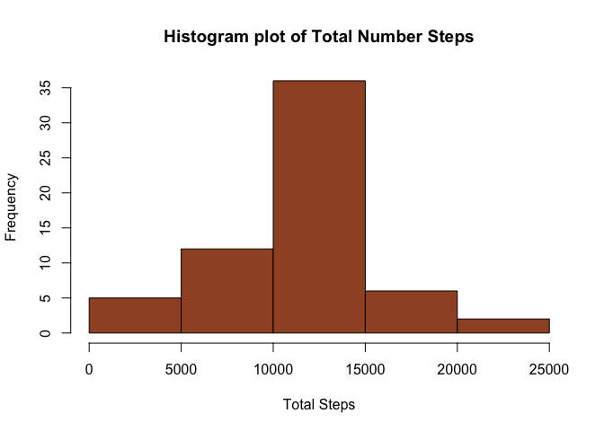
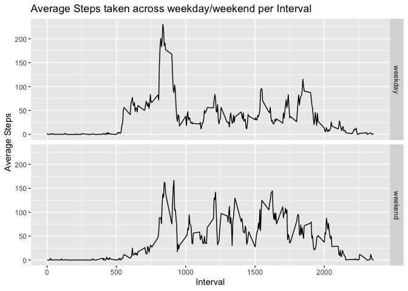

## Loading and preprocessing the data

### Load the data 

```r
library(tidyverse)
```

```
## ── Attaching core tidyverse packages ──────────────────────── tidyverse 2.0.0 ──
## ✔ dplyr     1.1.3     ✔ readr     2.1.4
## ✔ forcats   1.0.0     ✔ stringr   1.5.1
## ✔ ggplot2   3.5.1     ✔ tibble    3.2.1
## ✔ lubridate 1.9.2     ✔ tidyr     1.3.0
## ✔ purrr     1.0.2     
## ── Conflicts ────────────────────────────────────────── tidyverse_conflicts() ──
## ✖ dplyr::filter() masks stats::filter()
## ✖ dplyr::lag()    masks stats::lag()
## ℹ Use the conflicted package (<http://conflicted.r-lib.org/>) to force all conflicts to become errors
```

```r
activity <- read_csv("activity.csv")
```

```
## Rows: 17568 Columns: 3
## ── Column specification ────────────────────────────────────────────────────────
## Delimiter: ","
## dbl  (2): steps, interval
## date (1): date
## 
## ℹ Use `spec()` to retrieve the full column specification for this data.
## ℹ Specify the column types or set `show_col_types = FALSE` to quiet this message.
```

```r
head(activity)
```

```
## # A tibble: 6 × 3
##   steps date       interval
##   <dbl> <date>        <dbl>
## 1    NA 2012-10-01        0
## 2    NA 2012-10-01        5
## 3    NA 2012-10-01       10
## 4    NA 2012-10-01       15
## 5    NA 2012-10-01       20
## 6    NA 2012-10-01       25
```

```r
dim(activity)
```

```
## [1] 17568     3
```

```r
str(activity)
```

```
## spc_tbl_ [17,568 × 3] (S3: spec_tbl_df/tbl_df/tbl/data.frame)
##  $ steps   : num [1:17568] NA NA NA NA NA NA NA NA NA NA ...
##  $ date    : Date[1:17568], format: "2012-10-01" "2012-10-01" ...
##  $ interval: num [1:17568] 0 5 10 15 20 25 30 35 40 45 ...
##  - attr(*, "spec")=
##   .. cols(
##   ..   steps = col_double(),
##   ..   date = col_date(format = ""),
##   ..   interval = col_double()
##   .. )
##  - attr(*, "problems")=<externalptr>
```

### Process/transform the data

Transforming the variable 'date' to data format

```r
activity$date <- as.Date(activity$date, format = "%Y-%m-%d")
```

## What is mean total number of steps taken per day?

### Calculate the total number of step taken per day

```r
ts <- activity |> 
        group_by(date) |> 
        summarize(total_steps = sum(steps, na.rm=TRUE))

print(ts, n=10)
```

```
## # A tibble: 61 × 2
##    date       total_steps
##    <date>           <dbl>
##  1 2012-10-01           0
##  2 2012-10-02         126
##  3 2012-10-03       11352
##  4 2012-10-04       12116
##  5 2012-10-05       13294
##  6 2012-10-06       15420
##  7 2012-10-07       11015
##  8 2012-10-08           0
##  9 2012-10-09       12811
## 10 2012-10-10        9900
## # ℹ 51 more rows
```
This is the total steps taken by day (ignoring missing)

### Make a histogram of the total number of steps taken each day

```r
ggplot(data=ts, aes(x=total_steps))+
        geom_histogram(bins = 10, color="sienna")+
        labs(title = "Total Number of Steps Taken each day", x= "total steps", y="frequency")
```

<!-- -->


### Calculate and report the mean and median of the total number of steps taken per day

```r
summary(ts$total_steps, na.rm=TRUE)
```

```
##    Min. 1st Qu.  Median    Mean 3rd Qu.    Max. 
##       0    6778   10395    9354   12811   21194
```
The average number of steps per day is 9,354
The median number of steps per day is 10,395

## What is the average daily activity pattern?

### Times series plot of th 5-minute interval and the average number of steps taken...

```r
avg_steps <- activity %>%
        group_by(interval) %>%
        summarize(avg_steps = mean(steps, na.rm = TRUE))

ggplot(avg_steps, aes(x = interval, y = avg_steps)) +
                geom_line() +
                labs(title = "Average Number of Steps per 5-Minute Interval",
                x = "5-Minute Interval",
                y = "Average Number of Steps")
```

<!-- -->


### Which 5-minute interval contains the maximum number of steps?

```r
max_interval <- avg_steps %>%
        filter(avg_steps == max(avg_steps, na.rm = TRUE))

print(max_interval)
```

```
## # A tibble: 1 × 2
##   interval avg_steps
##      <dbl>     <dbl>
## 1      835      206.
```

The maximum average steps (206) is in interval 835 as the above line graph also reveals.


## Imputing missing values

### Calculate and report the total number of missing values in the dataset

```r
actv <- activity
summary(is.na(actv))
```

```
##    steps            date          interval      
##  Mode :logical   Mode :logical   Mode :logical  
##  FALSE:15264     FALSE:17568     FALSE:17568    
##  TRUE :2304
```
The total number of missing values in the dataset (rows with NAs) is 2,304.


### Devise a strategy for filling in all the missing values in the dataset


```r
actv1 <- filter(actv, !is.na(steps))
actv0 <- filter(actv, is.na(steps))
# Loop to fill NA steps with mean steps for the corresponding interval
for (i in unique(actv0$interval)) {
        actv0[actv0$interval == i, "steps"] <- avg_steps$avg_steps[avg_steps$interval == i]
}
```

###Create a new dataset that is equal to the original dataset but with the missing data filled in.

```r
filled_data <- bind_rows(actv1, actv0) |> 
        arrange(date, interval)
# Print the result
head(filled_data)
```

```
## # A tibble: 6 × 3
##    steps date       interval
##    <dbl> <date>        <dbl>
## 1 1.72   2012-10-01        0
## 2 0.340  2012-10-01        5
## 3 0.132  2012-10-01       10
## 4 0.151  2012-10-01       15
## 5 0.0755 2012-10-01       20
## 6 2.09   2012-10-01       25
```


### Make a histogram of the total number of steps each day, the mean and median 


```r
agg_step_new <- aggregate(filled_data$steps, by = list(filled_data$date), FUN = "sum")
hist(agg_step_new$x, col="sienna", main = "Histogram plot of Total Number Steps", xlab = "Total Steps")
```

<!-- -->

## Are the differences in activity patterns between weekdays and weekends

### Create a new factor variable dataset with two levels -- 'weekday' and 'weekend'

```r
# Adding column to hold the day of the week
filled_data <- mutate(filled_data, day = weekdays(date))
# Adding day category as 'weekend' and 'weekday'
filled_data$day_catg <- if_else(filled_data$day %in% c("Sunday", "Saturday"), 'weekend', "weekday")
filled_data$day_catg <- factor(filled_data$day_catg)
str(filled_data)
```

```
## tibble [17,568 × 5] (S3: tbl_df/tbl/data.frame)
##  $ steps   : num [1:17568] 1.717 0.3396 0.1321 0.1509 0.0755 ...
##  $ date    : Date[1:17568], format: "2012-10-01" "2012-10-01" ...
##  $ interval: num [1:17568] 0 5 10 15 20 25 30 35 40 45 ...
##  $ day     : chr [1:17568] "Monday" "Monday" "Monday" "Monday" ...
##  $ day_catg: Factor w/ 2 levels "weekday","weekend": 1 1 1 1 1 1 1 1 1 1 ...
```

```r
head(filled_data)
```

```
## # A tibble: 6 × 5
##    steps date       interval day    day_catg
##    <dbl> <date>        <dbl> <chr>  <fct>   
## 1 1.72   2012-10-01        0 Monday weekday 
## 2 0.340  2012-10-01        5 Monday weekday 
## 3 0.132  2012-10-01       10 Monday weekday 
## 4 0.151  2012-10-01       15 Monday weekday 
## 5 0.0755 2012-10-01       20 Monday weekday 
## 6 2.09   2012-10-01       25 Monday weekday
```

### Make a panel plot containing a time series plot of 5-minute interval averaged across all weekdays and weekend

```r
avg_step_week <- aggregate(steps ~ interval + day_catg, data = filled_data, FUN = "mean")
head(avg_step_week)
```

```
##   interval day_catg      steps
## 1        0  weekday 2.25115304
## 2        5  weekday 0.44528302
## 3       10  weekday 0.17316562
## 4       15  weekday 0.19790356
## 5       20  weekday 0.09895178
## 6       25  weekday 1.59035639
```


```r
g <- ggplot(data = avg_step_week, aes(x = interval, y = steps))
g <- g + facet_grid(day_catg ~ .)
g <- g + geom_line()
g <- g + labs(title = "Average Steps taken across weekday/weekend per Interval")
g <- g + labs(x = "Interval", y = "Average Steps")
print(g)
```

<!-- -->

